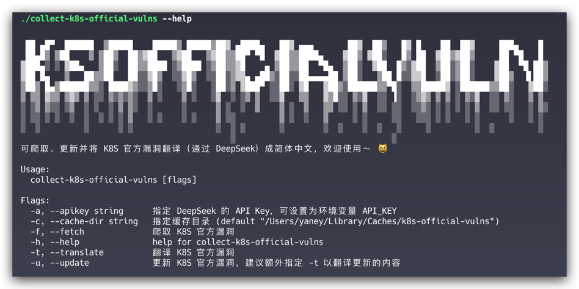
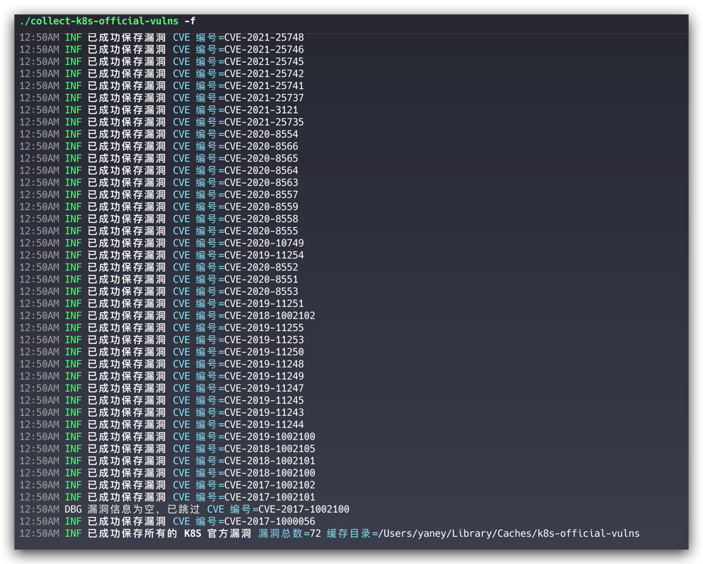

# collect-k8s-official-vulns
可爬取、更新并将 K8S 官方漏洞翻译（通过 DeepSeek）成简体中文，欢迎使用～ 😺


（PS：考虑到主要用户的母语可能为简体中文，所以该工具的日志语言为简体中文）

## 为什么需要它？

1. 漏洞预警：可及时监控 K8S 漏洞信息，方便运营人员进行应急响应。
2. 漏洞分析：可收集全量 K8S 漏洞信息，方便安全人员进行学习研究。
3. 便捷可读：可自动化收集 K8S 漏洞信息，按照公布时间进行分类， CVE 编号进行命名，渲染成 Markdown 格式，此外，还可以使用 DeepSeek 翻译成简体中文。

## 主要功能有什么？

### 1. 爬取 K8S 官方漏洞

- 漏洞数据源：<https://kubernetes.io/docs/reference/issues-security/official-cve-feed/index.json>
- 可通过 `--cache-dir` 指定缓存目录，默认的缓存目录为系统用户缓存目录下的 `k8s-official-vulns` 目录，也可以通过 `--help` 查看
- 漏洞会根据公布的年份和月份保存在对应的目录下，文件名为 CVE 编号，且格式为 Markdown，方便查看：<https://github.com/y4ney/k8s-official-vulns>

### 2. 翻译 K8S 官方漏洞

- 使用 DeepSeek 进行翻译，可通过[官方链接](https://platform.deepseek.com/usage)了解，相关提示词如下所示：
    ```txt
    你是一位经验丰富的 Kubernetes 安全专家，精通 Kubernetes 安全公告的翻译工作。
	你能精准地将英文内容翻译为地道、专业的简体中文，采用中国 Kubernetes 安全社区常用的术语。
	你会完整保留原文中的 Markdown 格式，包括标题、代码块、列表、链接等内容。不翻译代码块、命令、路径、配置字段，
	仅翻译说明性文字。不要添加任何解释或额外信息。
    ```
  
    ```txt
    请将以下 Kubernetes 安全公告内容翻译为简体中文，保持 Markdown 格式不变，不翻译代码块、命令和配置字段：

	----

    ```
- 可通过 `--apikey` 指定 API Key，但出于安全考虑，建议通过环境变量 `API_KEY` 来指定，采用的优先级是：Flag > Env。
- 翻译好的内容并不会覆盖原来的内容，而是放在相同的目录下，文件名（不含文件格式）后会有 `_zh` 后缀。


### 3. 更新 K8S 官方漏洞

- 每隔 6 小时，监控一次 K8S 官方漏洞源，先判断漏洞源的更新时间是否早于当前时间，若早于当前时间，不做更新，避免资源耗费。
- 若漏洞有更新（包括漏洞新增和漏洞修改），则通过对比缓存目录下的漏洞信息，获取增量的更新内容，再使用新的漏洞信息进行覆盖。
- 建议额外指定 `-t` 以翻译更新的内容。

## 如何使用？

1. 编译
    ```bash
    go build -o collect-k8s-official-vulns
    ```
2. 查看帮助
    ```bash
    collect-k8s-official-vulns --help
    ```
3. 爬取漏洞
    ```bash
    collect-k8s-official-vulns -f
    ```
   
4. 翻译漏洞
    ```bash
    collect-k8s-official-vulns -t
    ```
5. 更新漏洞，建议指定 -t 以翻译更新的内容
    ```bash
    collect-k8s-official-vulns -u -t
    ```


## 联系我？

别怕，我是只可爱的鬼 👻👻：Yaney-（微信号）